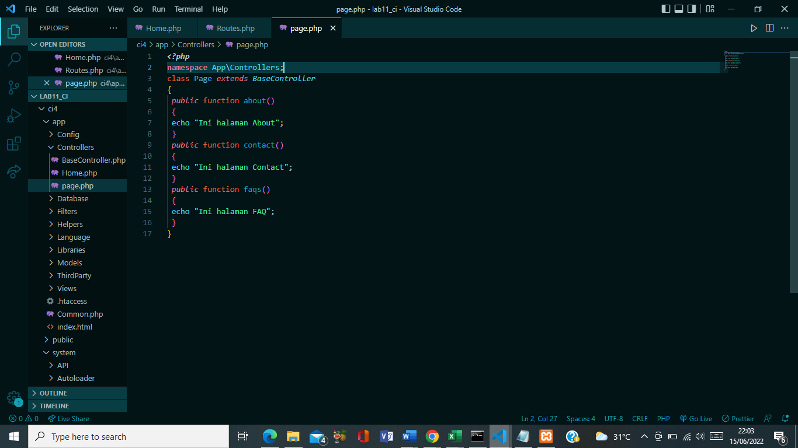

| Nama | Nova Tegar Adiyansyah |
| ---------- | ----------------| 
| Nim   |  312010145  | 
| Kelas  | TI.20.A1  | 

## Langkah-langkah Praktikum 11

## 1. Buat file Baru dengan nama header.php

## Instalasi Codeigniter 4

Untuk melakukan instalasi Codeigniter 4 dapat dilakukan dengan dua cara, yaitu cara 
manual dan menggunakan composer. Pada praktikum ini kita menggunakan cara 
manual.
• Unduh Codeigniter dari website https://codeigniter.com/download
• Extrak file zip Codeigniter ke direktori htdocs/lab11_ci.
• Ubah nama direktory framework-4.x.xx menjadi ci4.
• Buka browser dengan alamat http://localhost/lab11_ci/ci4/public/

## 2. Menjalankan CLI (Command Line Interface)
Codeigniter 4 menyediakan CLI untuk mempermudah proses development. Untuk 
mengakses CLI buka terminal/command prompt. 

Arahkan lokasi direktori sesuai dengan direktori kerja project dibuat 
(xampp/htdocs/lab11_ci/ci4/) 
Perintah yang dapat dijalankan untuk memanggil CLI Codeigniter adalah:
php spark

## 3. Mengaktifkan Mode Debugging
Codeigniter 4 menyediakan fitur debugging untuk memudahkan developer untuk 
mengetahui pesan error apabila terjadi kesalahan dalam membuat kode program.
Secara default fitur ini belum aktif. Ketika terjadi error pada aplikasi akan ditampilkan 
pesan kesalahan seperti berikut.

Semua jenis error akan ditampilkan sama. Untuk memudahkan mengetahui jenis 
errornya, maka perlu diaktifkan mode debugging dengan mengubah nilai konfigurasi 
pada environment variable CI_ENVIRINMENT menjadi development.

Ubah nama file env menjadi .env kemudian buka file tersebut dan ubah nilai variable 
CI_ENVIRINMENT menjadi development.

Fokus kita pada folder app, dimana folder tersebut adalah area kerja kita untuk 
membuat aplikasi. Dan folder public untuk menyimpan aset web seperti css, gambar, 
javascript, dll

## 4. Membuat Route Baru.
Tambahkan kode berikut di dalam Routes.php

Untuk mengetahui route yang ditambahkan sudah benar, buka CLI dan jalankan 
perintah berikut.
php spark routes

Selanjutnya coba akses route yang telah dibuat dengan mengakses alamat url 
http://localhost:8080/about

Ketika diakses akan mucul tampilan error, itu artinya file/page 
tersebut tidak ada. Untuk dapat mengakses halaman tersebut, harus dibuat terlebih 
dahulu Contoller yang sesuai dengan routing yang dibuat yaitu Contoller Page.

## 5. Membuat Controller
Selanjutnya adalah membuat Controller Page. Buat file baru dengan nama page.php 
pada direktori Controller kemudian isi kodenya seperti berikut.

Selanjutnya refresh Kembali browser, maka akan ditampilkan hasilnya yaotu halaman 
sudah dapat diakses.

## 6. Auto Routing

Secara default fitur autoroute pada Codeiginiter sudah aktif. Untuk mengubah status 
autoroute dapat mengubah nilai variabelnya. Untuk menonaktifkan ubah nilai true
menjadi false.

Method ini belum ada pada routing, sehingga cara mengaksesnya dengan menggunakan 
alamat: http://localhost:8080/page/tos

## 7. Membuat View
Selanjutnya adalam membuat view untuk tampilan web agar lebih menarik. Buat file 
baru dengan nama about.php pada direktori view (app/view/about.php) kemudian isi 
kodenya seperti berikut.
 
 

 Kemudian lakukan refresh pada halaman tersebut.

 

 ## 8. Membuat Layout Web dengan CSS

Buat file css pada direktori public dengan nama style.css (copy file dari praktikum 
lab4_layout. Kita akan gunakan layout yang pernah dibuat pada praktikum 4.

File app/view/template/header.php

File app/view/template/footer.php

Selanjutnya refresh tampilan pada alamat http://localhost:8080/about

## Lab 11 (lanjutan)

