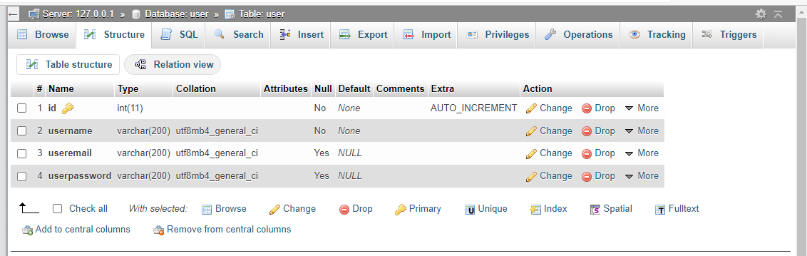
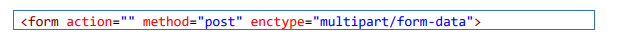

| Nama | Nova Tegar Adiyansyah |
| ---------- | ----------------| 
| Nim   |  312010145  | 
| Kelas  | TI.20.A1  | 

## Langkah-langkah Praktikum 11

## 1. Buat file Baru dengan nama header.php

## Instalasi Codeigniter 4

Untuk melakukan instalasi Codeigniter 4 dapat dilakukan dengan dua cara, yaitu cara 
manual dan menggunakan composer. Pada praktikum ini kita menggunakan cara 
manual.
• Unduh Codeigniter dari website https://codeigniter.com/download
• Extrak file zip Codeigniter ke direktori htdocs/lab11_ci.
• Ubah nama direktory framework-4.x.xx menjadi ci4.
• Buka browser dengan alamat http://localhost/lab11_ci/ci4/public/

## 2. Menjalankan CLI (Command Line Interface)
Codeigniter 4 menyediakan CLI untuk mempermudah proses development. Untuk 
mengakses CLI buka terminal/command prompt. 

Arahkan lokasi direktori sesuai dengan direktori kerja project dibuat 
(xampp/htdocs/lab11_ci/ci4/) 
Perintah yang dapat dijalankan untuk memanggil CLI Codeigniter adalah:
php spark

## 3. Mengaktifkan Mode Debugging
Codeigniter 4 menyediakan fitur debugging untuk memudahkan developer untuk 
mengetahui pesan error apabila terjadi kesalahan dalam membuat kode program.
Secara default fitur ini belum aktif. Ketika terjadi error pada aplikasi akan ditampilkan 
pesan kesalahan seperti berikut.

Semua jenis error akan ditampilkan sama. Untuk memudahkan mengetahui jenis 
errornya, maka perlu diaktifkan mode debugging dengan mengubah nilai konfigurasi 
pada environment variable CI_ENVIRINMENT menjadi development.

Ubah nama file env menjadi .env kemudian buka file tersebut dan ubah nilai variable 
CI_ENVIRINMENT menjadi development.

Fokus kita pada folder app, dimana folder tersebut adalah area kerja kita untuk 
membuat aplikasi. Dan folder public untuk menyimpan aset web seperti css, gambar, 
javascript, dll

## 4. Membuat Route Baru.
Tambahkan kode berikut di dalam Routes.php

Untuk mengetahui route yang ditambahkan sudah benar, buka CLI dan jalankan 
perintah berikut.
php spark routes

Selanjutnya coba akses route yang telah dibuat dengan mengakses alamat url 
http://localhost:8080/about

Ketika diakses akan mucul tampilan error, itu artinya file/page 
tersebut tidak ada. Untuk dapat mengakses halaman tersebut, harus dibuat terlebih 
dahulu Contoller yang sesuai dengan routing yang dibuat yaitu Contoller Page.

## 5. Membuat Controller
Selanjutnya adalah membuat Controller Page. Buat file baru dengan nama page.php 
pada direktori Controller kemudian isi kodenya seperti berikut.

Selanjutnya refresh Kembali browser, maka akan ditampilkan hasilnya yaotu halaman 
sudah dapat diakses.

## 6. Auto Routing

Secara default fitur autoroute pada Codeiginiter sudah aktif. Untuk mengubah status 
autoroute dapat mengubah nilai variabelnya. Untuk menonaktifkan ubah nilai true
menjadi false.

Method ini belum ada pada routing, sehingga cara mengaksesnya dengan menggunakan 
alamat: http://localhost:8080/page/tos

## 7. Membuat View
Selanjutnya adalam membuat view untuk tampilan web agar lebih menarik. Buat file 
baru dengan nama about.php pada direktori view (app/view/about.php) kemudian isi 
kodenya seperti berikut.
 
 

 Kemudian lakukan refresh pada halaman tersebut.

 

 ## 8. Membuat Layout Web dengan CSS

Buat file css pada direktori public dengan nama style.css (copy file dari praktikum 
lab4_layout. Kita akan gunakan layout yang pernah dibuat pada praktikum 4.

File app/view/template/header.php

File app/view/template/footer.php

Selanjutnya refresh tampilan pada alamat http://localhost:8080/about

## Praktikum 12: Framework Lanjutan (CRUD)

##  Langkah-langkah Praktikum

## Membuat Database

## Membuat tabel

## Konfigurasi koneksi database
Selanjutnya membuat konfigurasi untuk menghubungkan dengan database server. 
Konfigurasi dapat dilakukan dengan du acara, yaitu pada file app/config/database.php
atau menggunakan file .env. Pada praktikum ini kita gunakan konfigurasi pada file .env. 

## membuat model
Selanjutnya adalah membuat Model untuk memproses data Artikel. Buat file baru pada 
direktori app/Models dengan nama ArtikelModel.php

## Membuat Controller
Buat Controller baru dengan nama Artikel.php pada direktori app/Controllers.

## Membuat View
Buat direktori baru dengan nama artikel pada direktori app/views, kemudian buat file 
baru dengan nama index.php. 

Selanjutnya buka browser kembali, dengan mengakses url http://localhost:8080/artikel

Belum ada data yang diampilkan. Kemudian coba tambahkan beberapa data pada 
database agar dapat ditampilkan datanya.

Refresh kembali browser, sehingga akan ditampilkan hasilnya.

## Membuat Tampilan Detail Artikel
Tampilan pada saat judul berita di klik maka akan diarahkan ke halaman yang berbeda. 
Tambahkan fungsi baru pada Controller Artikel dengan nama view().

## Membuat View Detail
Buat view baru untuk halaman detail dengan nama app/views/artikel/detail.php.

## Membuat Routing untuk artikel detail
Buka Kembali file app/config/Routes.php, kemudian tambahkan routing untuk artikel 
detail

<em>$routes->get('/artikel/(:any)', 'Artikel::view/$1');</em>

## Membuat Menu Admin
Menu admin adalah untuk proses CRUD data artikel. Buat method baru pada 
Controller Artikel dengan nama admin_index(). 

Selanjutnya buat view untuk tampilan admin dengan nama admin_index.php

Tambahkan routing untuk menu admin seperti berikut:

<strong>
$routes->group('admin', function($routes) {
$routes->get('artikel', 'Artikel::admin_index');
$routes->add('artikel/add', 'Artikel::add');
$routes->add('artikel/edit/(:any)', 'Artikel::edit/$1');
$routes->get('artikel/delete/(:any)', 'Artikel::delete/$1');
});

</strong>
 

Akses menu admin dengan url http://localhost:8080/admin/artikel

## Menambah Data Artikel
Tambahkan fungsi/method baru pada Controller Artikel dengan nama add(). 

Kemudian buat view untuk form tambah dengan nama form_add.php

## Mengubah Data
Tambahkan fungsi/method baru pada Controller Artikel dengan nama edit(). 

Kemudian buat view untuk form tambah dengan nama form_edit.php

## Menghapus Data
Tambahkan fungsi/method baru pada Controller Artikel dengan nama delete().

## Praktikum 13: Framework Lanjutan (Modul Login)

## Langkah-langkah Praktikum
Persiapan.
Untuk memulai membuat modul Login, yang perlu disiapkan adalah database server 
menggunakan MySQL. Pastikan MySQL Server sudah dapat dijalankan melalui 
XAMPP.

## Membuat Tabel User

## Membuat Model User
Selanjutnya adalah membuat Model untuk memproses data Login. Buat file baru pada 
direktori app/Models dengan nama UserModel.php

Membuat Controller User
Buat Controller baru dengan nama User.php pada direktori app/Controllers.
Kemudian tambahkan method index() untuk menampilkan daftar user, dan method 
login() untuk proses login.

 

 ## Membuat View Login
Buat direktori baru dengan nama user pada direktori app/views, kemudian buat file 
baru dengan nama login.php.

## Membuat Database Seeder
Database seeder digunakan untuk membuat data dummy. Untuk keperluan ujicoba modul 
login, kita perlu memasukkan data user dan password kedaalam database. Untuk itu buat 
database seeder untuk tabel user. Buka CLI, kemudian tulis perintah berikut: <em> php spark make:seeder UserSeeder </em>

Selanjutnya, buka file UserSeeder.php yang berada di lokasi direktori 
/app/Database/Seeds/UserSeeder.php kemudian isi dengan kode berikut:

## Uji Coba Login
Selanjutnya buka url http://localhost:8080/user/login seperti berikut:

## Menambahkan Auth Filter
Selanjutnya membuat filer untuk halaman admin. Buat file baru dengan nama Auth.php
pada direktori app/Filters. 

Selanjutnya buka file app/Config/Filters.php tambahkan kode berikut:

Selanjutnya buka file app/Config/Routes.php dan sesuaikan kodenya.

## Percobaan Akses Menu Admin
Buka url dengan alamat http://localhost:8080/admin/artikel ketika alamat tersebut 
diakses maka, akan dimuculkan halaman login. 

## Fungsi Logout
Tambahkan method logout pada Controller User seperti berikut:

## Praktikum 14: Pagination dan Pencarian

## Langkah-langkah Praktikum
Membuat Pagination
Pagination merupakan proses yang digunakan untuk membatasi tampilan yang panjang 
dari data yang banyak pada sebuah website. Fungsi pagination adalah memecah 
tampilan menjadi beberapa halaman tergantung banyaknya data yang akan ditampilkan 
pada setiap halaman

## membuat pagination 
Untuk membuat pagination, buka Kembali Controller Artikel, kemudian modifikasi 
kode pada method admin_index seperti berikut.

Kemudian buka file views/artikel/admin_index.php dan tambahkan kode berikut
dibawah deklarasi tabel data.

<em><
?= $pager->links(); ?>
</em>

Selanjutnya buka kembali menu daftar artikel, tambahkan data lagi untuk melihat 
hasilnya.

## Membuat Pencarian
Pencarian data digunakan untuk memfilter data.
Untuk membuat pencarian data, buka kembali Controller Artikel, pada method 
admin_index ubah kodenya seperti berikut

Kemudian buka kembali file views/artikel/admin_index.php dan tambahkan form 
pencarian sebelum deklarasi tabel seperti berikut:

Selanjutnya ujicoba dengan membuka kembali halaman admin artikel, masukkan kata 
kunci tertentu pada form pencarian

## Upload Gambar
Menambahkan fungsi unggah gambar pada tambah artikel. Buka kembali Controller 
Artikel, sesuaikan kode pada method add seperti berikut:

Kemudian pada file views/artikel/form_add.php tambahkan field input file seperti 
berikut.

Dan sesuaikan tag form dengan menambahkan ecrypt type seperti berikut.

Ujicoba file upload dengan mengakses menu tambah artikel

